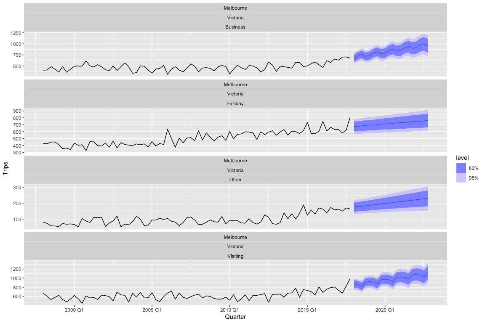
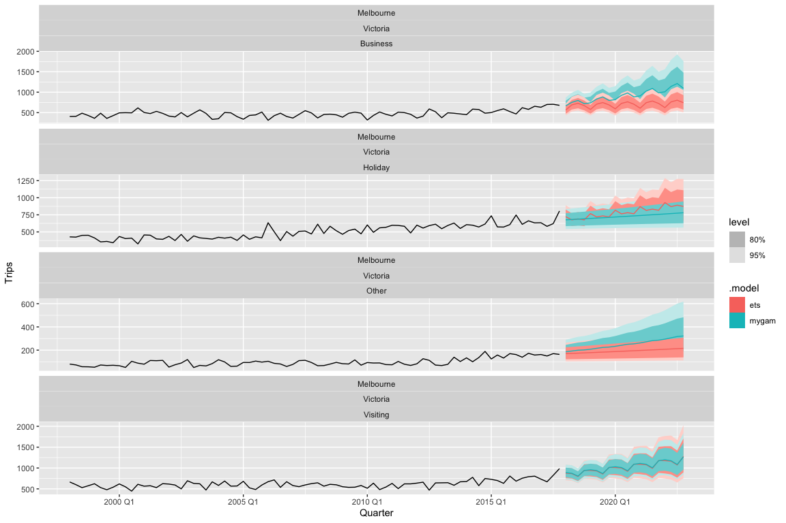
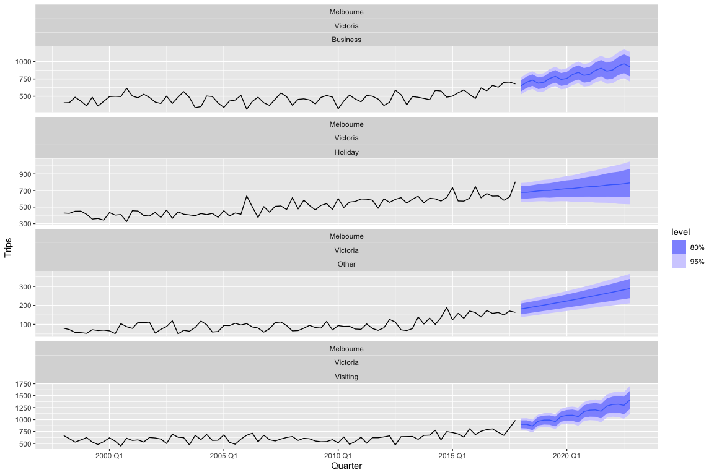
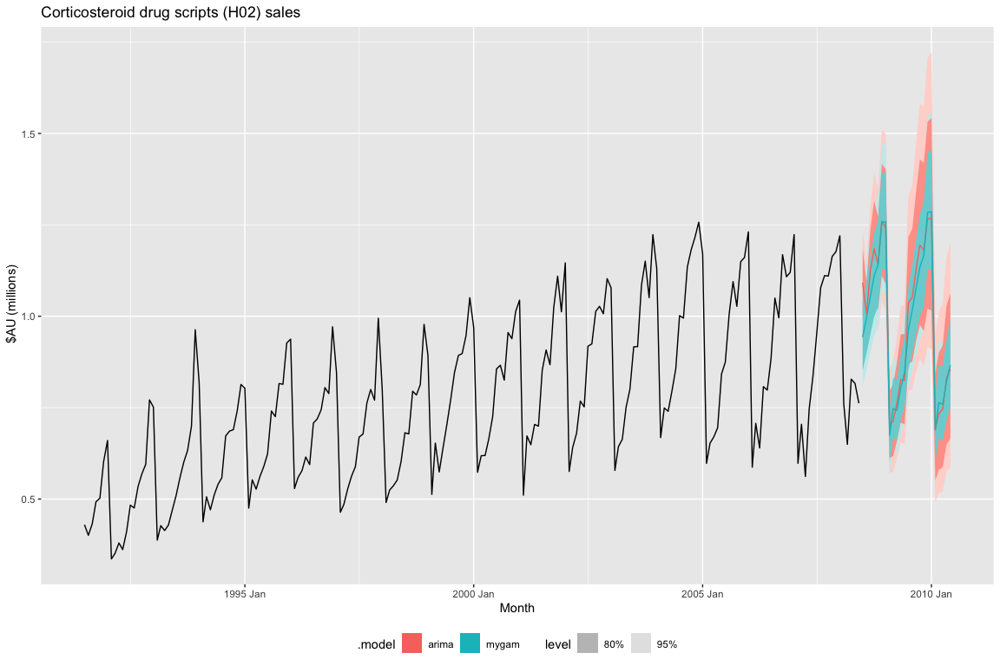

# fable.gam

This package provides a tidy R interface to time-series modelling using
[generalised additive
models](https://en.wikipedia.org/wiki/Generalized_additive_model) (GAMs)
using [fable](https://github.com/tidyverts/fable). This package makes
use of the [mgcv package](https://cran.r-project.org/package=mgcv) for
R. While not particularly common, GAMs have shown incredible utility in
time-series modelling, such as in the context of [palaeoecological
data](https://www.frontiersin.org/journals/ecology-and-evolution/articles/10.3389/fevo.2018.00149/full).
This package aims to incorporate the broad conceptual approach of using
[structural time-series
models](https://blog.tensorflow.org/2019/03/structural-time-series-modeling-in.html)
(i.e., decomposing a time series into its trend, seasonality, error, and
other components and modelling them additively) within a GAM setup into
the incredible `fable` forecasting framework.

## Installation

You can install the development version of `fable.gam` from GitHub using
the following:

``` r
devtools::install_github("hendersontrent/fable.gam")
```

## Quick tour

``` r
library(tsibble)
library(dplyr)
library(ggplot2)
library(fable)
library(fable.gam)
library(tsibbledata)
```

Just like in the [`fable`
vignette](https://fable.tidyverts.org/articles/fable.html) we are going
to try and forecast the number of domestic travellers to Melbourne,
Australia. In the
[`tsibble::tourism`](https://tsibble.tidyverts.org/reference/tourism.html)
data set, this can be further broken down into 4 reasons of travel:
`“business”`, `“holiday”`, `“visiting friends and relatives”` and
`“other reasons”`. The variable we are going to try and forecast is the
number of overnight trips (000s) represented by the `Trips` variable.

Thanks to the excellent `tsibble` data structure for storing time-series
data in R we know that this data is sampled quarterly. With that in
mind, we are going to fit a simple time-series GAM using a (non)linear
trend term and a seasonal term with a periodicity of 4. This is made
easy in `fable.gam` through the usage of the `fabletools` ‘special’
functions `trend` and `season` which have been modified in `fable.gam`
for the purposes of GAMs. Under the hood, `fable.gam` parses a `trend()`
call as modelling a smooth function over time to capture temporal
effects and a `season()` call as a smooth function using a [cyclic cubic
basis
spline](https://fromthebottomoftheheap.net/2014/05/09/modelling-seasonal-data-with-gam/)
to ensure that over the duration of the time series, the start and end
of a seasonal term connects (e.g., for data measured on a monthly basis,
the end of final month – December – needs to connect continuously to the
start of the following January).

Here is how easy this is to do in `fable.gam` through the `GAM()`
function integrated into the `fable` interface:

``` r
tourism_melb <- tsibble::tourism |>
  filter(Region == "Melbourne")

fit <- tourism_melb |>
  model(mygam = GAM(Trips ~ trend() + season(4)))
```

We can then easily pipe into the rest of the `fable` functionality, such
as the `forecast` to produce forecasts. Here are automatic forecasts
using the GAM for the next 5 years:

``` r
fc <- fit |>
  forecast(h = "5 years")

fc |>
  autoplot(tourism_melb)
```

<!-- -->

We could then quantify model accuracy using the `accuracy` function in
`fable`:

``` r
fit |>
  accuracy() |>
  arrange(MASE)
```

    # A tibble: 4 × 13
      Region    State  Purpose .model .type        ME  RMSE   MAE    MPE  MAPE  MASE
      <chr>     <chr>  <chr>   <chr>  <chr>     <dbl> <dbl> <dbl>  <dbl> <dbl> <dbl>
    1 Melbourne Victo… Busine… mygam  Trai…  1.62e-14  52.0  39.7 -1.44   8.88 0.640
    2 Melbourne Victo… Visiti… mygam  Trai…  9.20e-14  52.1  41.4 -0.751  6.76 0.660
    3 Melbourne Victo… Holiday mygam  Trai…  1.37e-13  50.1  38.9 -0.990  7.79 0.706
    4 Melbourne Victo… Other   mygam  Trai… -6.66e-15  19.1  15.8 -4.64  18.1  0.710
    # ℹ 2 more variables: RMSSE <dbl>, ACF1 <dbl>

Another common task is to extract point forecasts and confidence
intervals from the forecast distribution. The
[`hilo`](https://pkg.mitchelloharawild.com/distributional/reference/hilo.html)
function from the
[`distributional`](https://github.com/mitchelloharawild/distributional)
package knows how to automatically handle models fit in `fable`:

``` r
fc |>
  hilo(level = c(80, 95))
```

    # A tsibble: 80 x 9 [1Q]
    # Key:       Region, State, Purpose, .model [4]
       Region    State    Purpose  .model Quarter
       <chr>     <chr>    <chr>    <chr>    <qtr>
     1 Melbourne Victoria Business mygam  2018 Q1
     2 Melbourne Victoria Business mygam  2018 Q2
     3 Melbourne Victoria Business mygam  2018 Q3
     4 Melbourne Victoria Business mygam  2018 Q4
     5 Melbourne Victoria Business mygam  2019 Q1
     6 Melbourne Victoria Business mygam  2019 Q2
     7 Melbourne Victoria Business mygam  2019 Q3
     8 Melbourne Victoria Business mygam  2019 Q4
     9 Melbourne Victoria Business mygam  2020 Q1
    10 Melbourne Victoria Business mygam  2020 Q2
    # ℹ 70 more rows
    # ℹ 4 more variables: Trips <dist>, .mean <dbl>, `80%` <hilo>, `95%` <hilo>

Hopefully this is starting to highlight the power of why integrating new
methods into the `fable` framework rather than writing bespoke pipelines
is so powerful!

### Comparison to other common time-series methods

We can perform a quick sense-check of the approach against more
commonly-used forecasting methods such as [exponential
smoothing](https://otexts.com/fpp3/expsmooth.html). Here we will just
specify an additive trend for the ETS model and let the other components
be determined automatically. We will also log-transform the response
variable to show that `fable.gam` handles these transformations
automatically as well, just like all models in `fable`.

``` r
tourism_melb |>
  model(
    mygam = GAM(log(Trips) ~ trend() + season(4)),
    ets = ETS(log(Trips) ~ trend("A"))
  ) |>
  forecast(h = "5 years") |>
  autoplot(tourism_melb)
```

<!-- -->

### Controlling the smooth function of the time trend

In addition to the `trend()` and `season()` special functions,
`fable.gam` also includes the special `trend2()` which lets users
control the smooth term fit to the temporal trend. `trend2()` takes
arguments `k` (the dimension of the basis used to represent the smooth
term; i.e., the number of knots) and `bs` (a two letter character string
indicating the smoothing basis to use). Here is an example where we
specify a basis of 5 and a [Gaussian
process](https://en.wikipedia.org/wiki/Gaussian_process) smooth:

``` r
tourism_melb |>
  model(mygam = GAM(Trips ~ trend2(k = 5, bs = "gp") + season(4))) |>
  forecast(h = "5 years") |>
  autoplot(tourism_melb)
```

<!-- -->

### Model fit

The suite of `fable` functions for interpreting trained models are also
available to `GAM` models fit using `fable.gam`. `glance()` is one such
example:

``` r
tourism_melb |>
  model(mygam = GAM(Trips ~ trend2(k = 5, bs = "gp") + season(4))) |>
  glance()
```

    # A tibble: 4 × 13
      Region State Purpose .model r_squared deviance    df log_lik   AIC   BIC   edf
      <chr>  <chr> <chr>   <chr>      <dbl>    <dbl> <dbl>   <dbl> <dbl> <dbl> <dbl>
    1 Melbo… Vict… Busine… mygam      0.569  235947.  74.2   -433.  880.  896.  5.79
    2 Melbo… Vict… Holiday mygam      0.752  197173.  74.9   -426.  864.  878.  5.06
    3 Melbo… Vict… Other   mygam      0.641   31195.  75.9   -352.  714.  726.  4.06
    4 Melbo… Vict… Visiti… mygam      0.640  231727.  73.4   -432.  880.  898.  6.61
    # ℹ 2 more variables: GCV <dbl>, scale <dbl>

## A more complicated example

`fable.gam` also permits the ability to specify autocorrelated errors to
capture residual serial correlation, just like you can do using a `gamm`
instead of a `gam` in `mgcv`. Here is another example from
[`fpp3`](https://otexts.com/fpp3/seasonal-arima.html) which is seasonal,
autocorrelated data with a small trend (note the addition of the
`fable.gam` special `errors(ar = 2)` which captures the autocorrelation
at lag 2 identified in `fpp3`).

``` r
h02 <- tsibbledata::PBS |>
  filter(ATC2 == "H02") |>
  summarise(Cost = sum(Cost) / 1e6)

h02 |>
  model(
    mygam = GAM(log(Cost) ~ trend() + season(12) + errors(ar = 2)),
    arima = ARIMA(log(Cost) ~ 0 + pdq(3, 0, 1) + PDQ(0, 1, 2))
    ) |>
  forecast() |>
  autoplot(h02) +
  labs(y = " $AU (millions)",
       title = "Corticosteroid drug scripts (H02) sales") +
  theme(legend.position = "bottom")
```

<!-- -->

## Development notes

`fable.gam` is very much a work in progress. Not all current `fable`
model functionality has been integrated yet and there may be issues with
model estimation until further testing and validation is performed.
