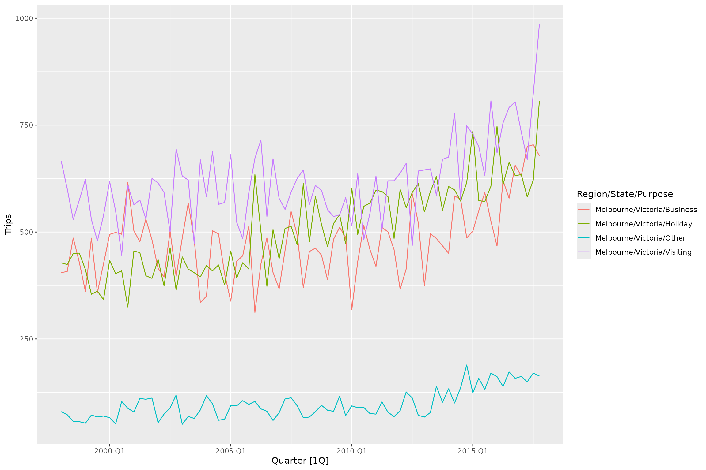
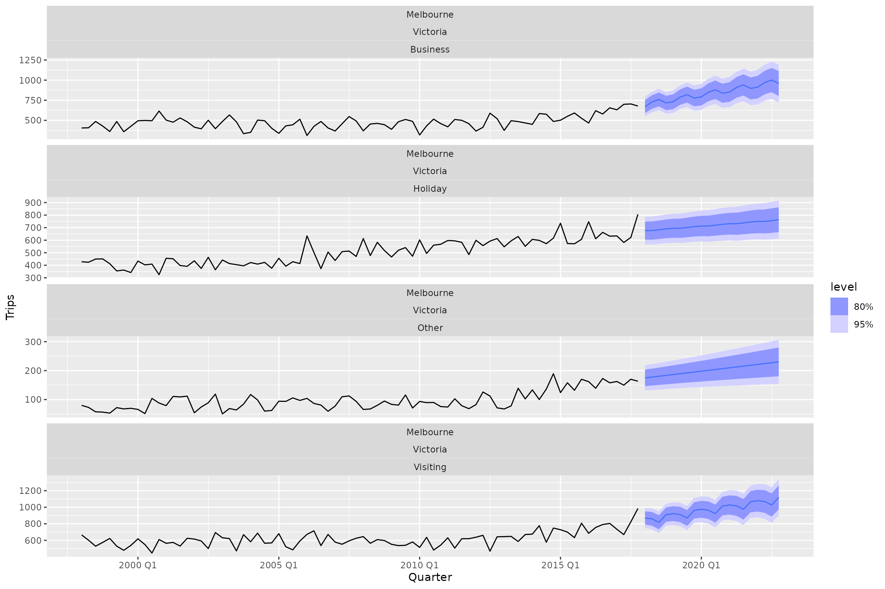
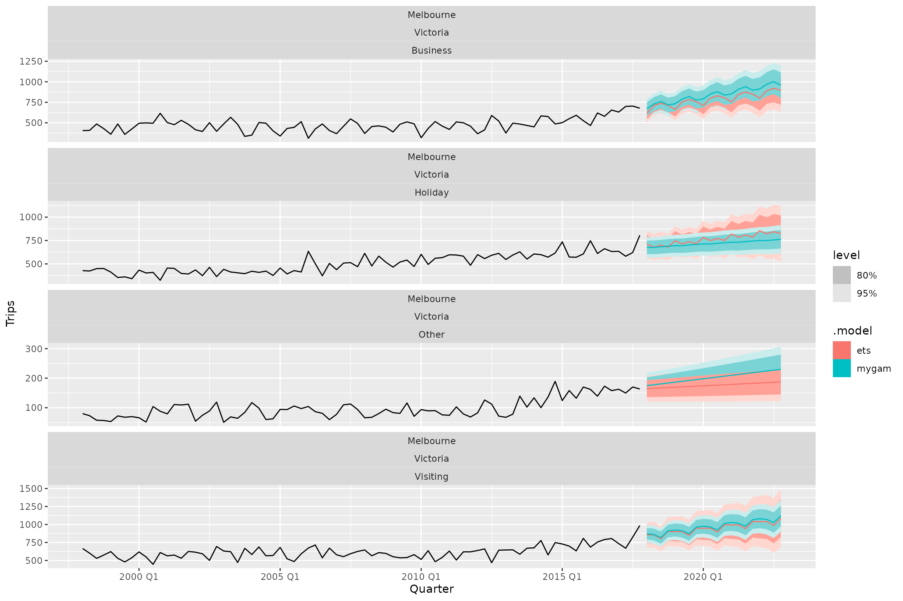
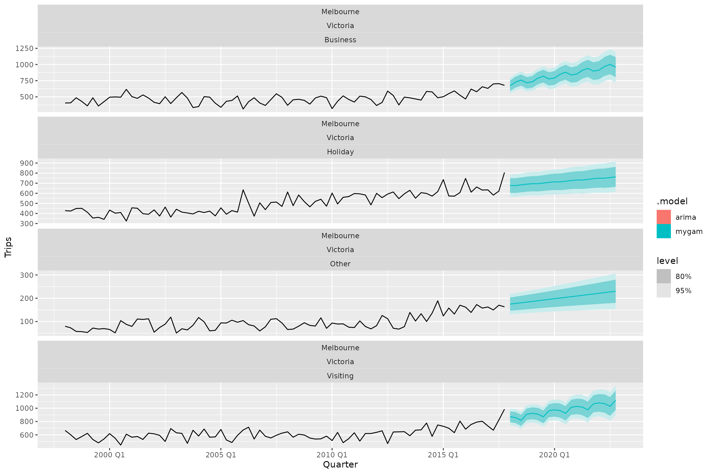
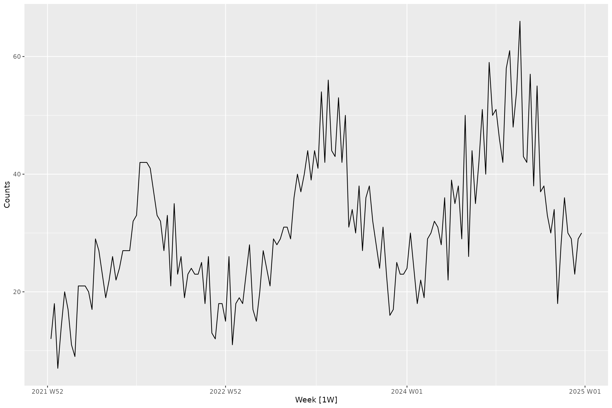
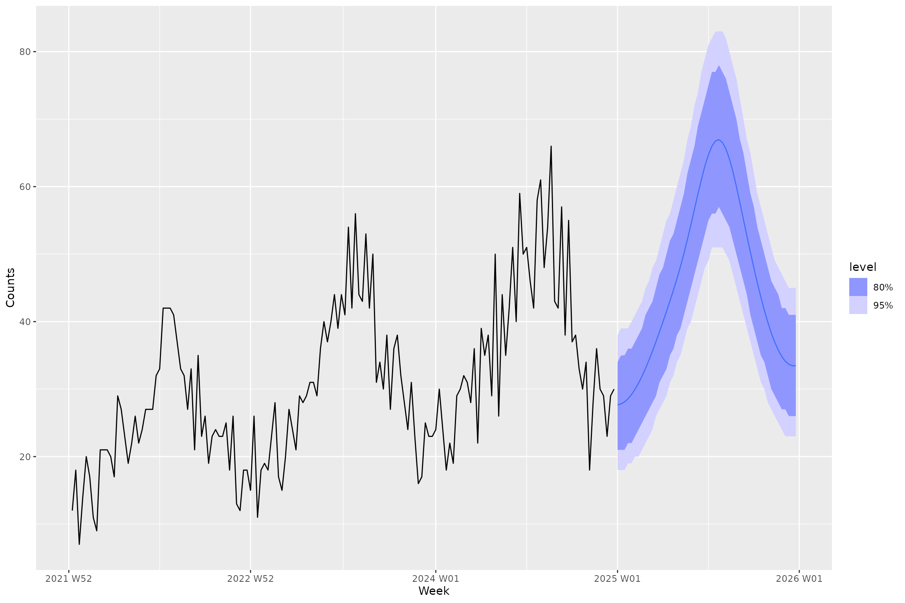
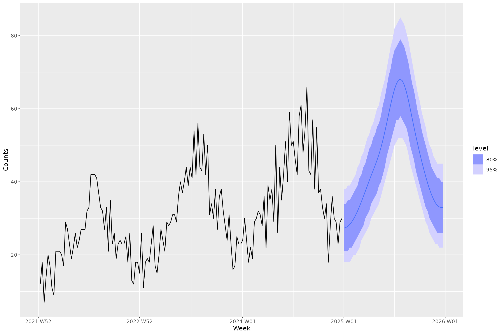

# Introduction to fable.gam

``` r

library(tsibble)
library(dplyr)
library(fable)
library(fable.gam)
```

This package provides a tidy R interface to time-series modelling using
[generalised additive
models](https://en.wikipedia.org/wiki/Generalized_additive_model) (GAMs)
using [fable](https://github.com/tidyverts/fable). This package makes
use of the [mgcv package](https://cran.r-project.org/package=mgcv) for
R. While not particularly common, GAMs have shown incredible utility in
time-series modelling, such as in the context of [palaeoecological
data](https://www.frontiersin.org/journals/ecology-and-evolution/articles/10.3389/fevo.2018.00149/full).
This package aims to incorporate the broad conceptual approach of using
[structural time-series
models](https://blog.tensorflow.org/2019/03/structural-time-series-modeling-in.html)
within a GAM setup into the incredible `fable` forecasting framework.

## Walkthrough of package functionality

Just like in the [`fable`
vignette](https://fable.tidyverts.org/articles/fable.html) we are going
to try and forecast the number of domestic travellers to Melbourne,
Australia. In the
[`tsibble::tourism`](https://tsibble.tidyverts.org/reference/tourism.html)
data set, this can be further broken down into 4 reasons of travel:
`“business”`, `“holiday”`, `“visiting friends and relatives”` and
`“other reasons”`. The variable we are going to try and forecast is the
number of overnight trips (000s) represented by the `Trips` variable. We
can load the dataset and visualise the time series as follows:

``` r

tourism_melb <- tourism |>
  filter(Region == "Melbourne")

tourism_melb |>
  autoplot(Trips)
```



Thanks to the excellent `tsibble` data structure for storing time-series
data in R we know that this data is sampled quarterly. With that in
mind, we are going to fit a simple time-series GAM using a (non)linear
trend term and a seasonal term with a periodicity of 4. This is made
easy in `fable.gam` through the usage of the `fabletools` ‘special’
functions `trend` and `season` which have been modified in `fable.gam`
for the purposes of GAMs. Under the hood, `fable.gam` parses a `trend()`
call as modelling a smooth function over time to capture temporal
effects and a `season()` call as a smooth function using a [cyclic cubic
basis
spline](https://fromthebottomoftheheap.net/2014/05/09/modelling-seasonal-data-with-gam/)
to ensure that over the duration of the time series, the start and end
of a seasonal term connects (e.g., for data measured on a monthly basis,
the end of final month – December – needs to connect continuously to the
start of the following January).

Here is how easy this is to do in `fable.gam` through the
[`GAM()`](https://hendersontrent.github.io/fable.gam/reference/GAM.md)
function integrated into the `fable` interface:

``` r

fit <- tourism_melb |>
  model(mygam = GAM(Trips ~ trend() + season(4)))
```

We can then easily pipe into the rest of the `fable` functionality, such
as the `forecast` to produce forecasts. Here are automatic forecasts
using the GAM for the next 5 years:

``` r

fc <- fit |>
  forecast(h = "5 years")

fc |>
  autoplot(tourism_melb)
```



We could then quantify model accuracy using the `accuracy` function in
`fable`:

``` r
fit |>
  accuracy() |>
  arrange(MASE)

[38;5;246m# A tibble: 4 × 13
[39m
  Region    State  Purpose .model .type        ME  RMSE   MAE    MPE  MAPE  MASE
  
[3m
[38;5;246m<chr>
[39m
[23m     
[3m
[38;5;246m<chr>
[39m
[23m  
[3m
[38;5;246m<chr>
[39m
[23m   
[3m
[38;5;246m<chr>
[39m
[23m  
[3m
[38;5;246m<chr>
[39m
[23m     
[3m
[38;5;246m<dbl>
[39m
[23m 
[3m
[38;5;246m<dbl>
[39m
[23m 
[3m
[38;5;246m<dbl>
[39m
[23m  
[3m
[38;5;246m<dbl>
[39m
[23m 
[3m
[38;5;246m<dbl>
[39m
[23m 
[3m
[38;5;246m<dbl>
[39m
[23m

[38;5;250m1
[39m Melbourne Victo… Busine… mygam  Trai…  1.17
[38;5;246me
[39m
[31m-13
[39m  52.0  39.7 -
[31m1
[39m
[31m.
[39m
[31m44
[39m   8.88 0.640

[38;5;250m2
[39m Melbourne Victo… Visiti… mygam  Trai… -
[31m2
[39m
[31m.
[39m
[31m39
[39m
[38;5;246me
[39m
[31m-13
[39m  52.1  41.4 -
[31m0
[39m
[31m.
[39m
[31m751
[39m  6.76 0.660

[38;5;250m3
[39m Melbourne Victo… Holiday mygam  Trai… -
[31m2
[39m
[31m.
[39m
[31m56
[39m
[38;5;246me
[39m
[31m-14
[39m  50.1  38.9 -
[31m0
[39m
[31m.
[39m
[31m990
[39m  7.79 0.706

[38;5;250m4
[39m Melbourne Victo… Other   mygam  Trai… -
[31m1
[39m
[31m.
[39m
[31m30
[39m
[38;5;246me
[39m
[31m-14
[39m  19.1  15.8 -
[31m4
[39m
[31m.
[39m
[31m64
[39m  18.1  0.710

[38;5;246m# ℹ 2 more variables: RMSSE <dbl>, ACF1 <dbl>
[39m
```

Another common task is to extract point forecasts and confidence
intervals from the forecast distribution. The
[`hilo`](https://pkg.mitchelloharawild.com/distributional/reference/hilo.html)
function from the
[`distributional`](https://github.com/mitchelloharawild/distributional)
package knows how to automatically handle models fit in `fable`:

``` r
fc |>
  hilo(level = c(80, 95))

[38;5;246m# A tsibble: 80 x 9 [1Q]
[39m

[38;5;246m# Key:       Region, State, Purpose, .model [4]
[39m
   Region    State    Purpose  .model Quarter
   
[3m
[38;5;246m<chr>
[39m
[23m     
[3m
[38;5;246m<chr>
[39m
[23m    
[3m
[38;5;246m<chr>
[39m
[23m    
[3m
[38;5;246m<chr>
[39m
[23m    
[3m
[38;5;246m<qtr>
[39m
[23m

[38;5;250m 1
[39m Melbourne Victoria Business mygam  2018 Q1

[38;5;250m 2
[39m Melbourne Victoria Business mygam  2018 Q2

[38;5;250m 3
[39m Melbourne Victoria Business mygam  2018 Q3

[38;5;250m 4
[39m Melbourne Victoria Business mygam  2018 Q4

[38;5;250m 5
[39m Melbourne Victoria Business mygam  2019 Q1

[38;5;250m 6
[39m Melbourne Victoria Business mygam  2019 Q2

[38;5;250m 7
[39m Melbourne Victoria Business mygam  2019 Q3

[38;5;250m 8
[39m Melbourne Victoria Business mygam  2019 Q4

[38;5;250m 9
[39m Melbourne Victoria Business mygam  2020 Q1

[38;5;250m10
[39m Melbourne Victoria Business mygam  2020 Q2

[38;5;246m# ℹ 70 more rows
[39m

[38;5;246m# ℹ 4 more variables: Trips <dist>, .mean <dbl>, `80%` <hilo>, `95%` <hilo>
[39m
```

Hopefully this is starting to highlight the power of why integrating new
methods into the `fable` framework rather than writing bespoke pipelines
is so powerful!

### Comparison to other common time-series methods

We can perform a quick sense-check of the approach against more
commonly-used forecasting methods such as [exponential
smoothing](https://otexts.com/fpp3/expsmooth.html). Here we will just
specify an additive trend for the ETS model and let the other components
be determined automatically:

``` r

tourism_melb |>
  model(
    mygam = GAM(Trips ~ trend() + season(4)),
    ets = ETS(Trips ~ trend("A"))
  ) |>
  forecast(h = "5 years") |>
  autoplot(tourism_melb)
```



Or maybe we want to compare against an [ARIMA
model](https://otexts.com/fpp3/arima.html):

``` r

tourism_melb |>
  model(
    mygam = GAM(Trips ~ trend() + season(4)),
    arima = ARIMA(Trips)
  ) |>
  forecast(h = "5 years") |>
  autoplot(tourism_melb)
```



## Non-Gaussian likelihoods

`fable.gam` is currently equipped to handle a few model families and
link functions available to users familiar with fitting GAMs in `mgcv`:

- Gaussian family with any link function (e.g., identity)
- Gamma family with log link
- Poisson family with log link
- Negative binomial family with log link
- Beta family with logit (default) or probit link

These are the current options as there are clean mappings between their
statistical form in `mgcv` and the `distributional` package which stores
vectorised distribution objects for easy calculations.

To test this functionality, we can simulate some weekly count data from
a Poisson distribution with a small upward trend and seasonality and
inspect the raw time series:

``` r

set.seed(123)
n_weeks <- 156
start <- as.Date("2022-01-03")
dates <- start + (0:(n_weeks - 1)) * 7
t_coef <- seq_len(n_weeks)
trend <- 0.004 * t_coef
month_no <- lubridate::month(dates)
month_fx <- c(-0.35, -0.25, -0.05,  0.10,  0.25,  0.45, 0.50,  0.40,  0.20,  0.00, -0.20, -0.35)
seasonal <- month_fx[month_no]
log_lambda <- 3.0 + trend + seasonal
counts <- rpois(n_weeks, lambda = exp(log_lambda))

# Convert to tsibble and plot to visualise temporal pattern

weekly_counts <- tsibble(Week = yearweek(dates), Counts = counts, index = Week)
autoplot(weekly_counts, Counts)
```



We can now fit a GAM forecast model and specify the Poisson model family
using the [`family()`](https://rdrr.io/r/stats/family.html) special
function that is designed to work in `fable.gam` (note that you only
need to specify the `link` argument of
[`family()`](https://rdrr.io/r/stats/family.html) if you are using a
Gaussian model family since a log-link is used for all others).

``` r

weekly_counts |>
  model(gam = GAM(Counts ~ trend() + season(12) + season(52) + family(poisson))) |> 
  forecast(h = "52 weeks") |>
  autoplot(weekly_counts)
```



We can also fit a negative binomial model to the same data as a
comparison:

``` r

weekly_counts |>
  model(gam = GAM(Counts ~ trend() + season(12) + season(52) + family(mgcv::nb()))) |> 
  forecast(h = "52 weeks") |>
  autoplot(weekly_counts)
```


